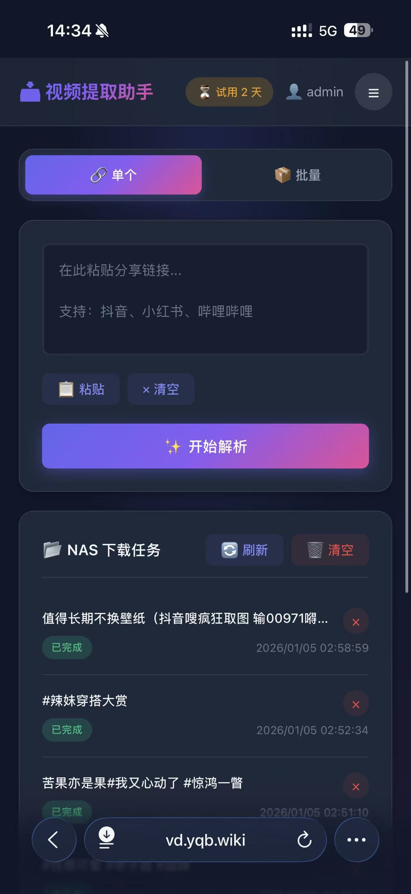
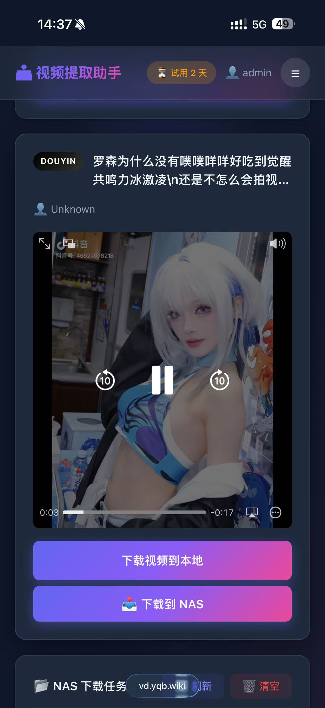
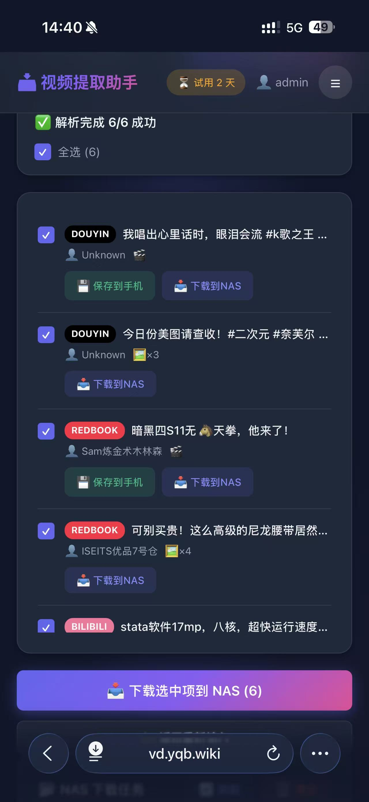

# 📥 视频下载助手 | Video Downloader

[English](#english) | [中文](#中文)

---

<a name="中文"></a>
## 🇨🇳 中文

一个 Docker 容器化的视频/图集下载工具，支持抖音、小红书、B站、快手、百度等主流平台。专为 NAS 用户设计，也可部署在任何支持 Docker 的环境中。
-重磅更新，现在支持通过企业微信推送，自动下载到 nas 了！！！！！！
### ✨ 功能特点

- 🎬 **多平台支持**: 抖音、小红书、哔哩哔哩、快手、百度
- 📷 **视频+图集**: 同时支持视频下载和图集提取
- 🔗 **智能解析**: 自动识别分享文本中的链接，自动处理短链重定向
- 📱 **移动端优化**: 响应式设计，手机浏览器完美适配
- 🖥️ **NAS 下载**: 支持直接下载到服务器存储
- 💬 **企业微信推送**: 发送链接到企业微信，自动下载到 NAS
- 🔐 **用户认证**: 内置登录系统，支持两步验证(2FA)
- 🐳 **多架构支持**: 同时支持 amd64 和 arm64

### 📸 界面预览

<p align="center">
  
  
  
</p>

### 📦 快速开始

#### Docker 运行

```bash
# 拉取镜像
docker pull snakebang007/video-downloader:latest

# 运行容器
docker run -d \
  --name video-downloader \
  -p 7895:5000 \
  -v /your/app-data:/app/data \
  -v /your/downloads:/downloads \
  snakebang007/video-downloader:latest
```

其中 `/app/data` 用于保存数据库、登录、license、企业微信等应用数据，`/downloads` 用于保存下载的视频、图集和封面文件。

已有部署如果之前只挂载了 `/app/data`，升级后请增加 `/downloads` 挂载；如果希望继续把下载文件放在旧目录，可额外设置 `DOWNLOAD_DIR=/app/data/downloads`。

高级用法：如果需要使用其他容器内下载目录，可以通过 `DOWNLOAD_DIR` 覆盖。相对路径会基于容器内工作目录解析，宿主机目录仍需通过 Docker volume/bind mount 映射进去。

```bash
docker run -d \
  --name video-downloader \
  -p 7895:5000 \
  -v /your/app-data:/app/data \
  -e DOWNLOAD_DIR=/media \
  -v /your/downloads:/media \
  snakebang007/video-downloader:latest
```

#### Docker Compose

仓库已提供 `docker-compose.yml`，默认访问端口为 `7895`：

```bash
docker compose pull
docker compose up -d
```

默认会把当前目录的 `./data` 挂载到容器 `/app/data`，把 `./downloads` 挂载到容器 `/downloads`。

如果需要在 NAS 上指定宿主机目录：

```bash
APP_PORT=7895 \
APP_DATA_DIR=/your/app-data \
DOWNLOADS_DIR=/your/downloads \
docker compose pull

APP_PORT=7895 \
APP_DATA_DIR=/your/app-data \
DOWNLOADS_DIR=/your/downloads \
docker compose up -d
```

高级自定义容器内下载目录：

```yaml
services:
  video-downloader:
    image: snakebang007/video-downloader:latest
    container_name: video-downloader
    ports:
      - "7895:5000"
    environment:
      - DOWNLOAD_DIR=/media
    volumes:
      - ./data:/app/data
      - /your/downloads:/media
    restart: unless-stopped
```

### 🔧 配置说明

| 环境变量 | 默认值 | 说明 |
|---------|--------|------|
| `PORT` | 5000 | 服务端口 |
| `DOWNLOAD_DIR` | Docker: `/downloads`；本地: `data/downloads` | 高级选项：覆盖下载文件保存目录；相对路径基于容器内工作目录解析 |

| 挂载目录 | 说明 |
|---------|------|
| `/app/data` | 应用数据目录（数据库、登录、license、企业微信配置等） |
| `/downloads` | Docker 默认下载目录（视频、图集、封面等媒体文件）；宿主机目录需要可写 |

### 🚀 首次使用

1. 访问 `http://your-server:7895`
2. 默认管理员账号: `admin` / `admin`
3. **首次登录后请立即修改密码**

### 📱 使用方式

1. **解析模式**: 粘贴链接 → 解析 → 在线预览/下载到手机
2. **下载模式**: 粘贴链接 → 下载到服务器 → 通过 NAS 访问
3. **微信推送**: 发送链接到企业微信 → 自动下载到 NAS → 接收完成通知

### 💬 企业微信机器人

支持通过企业微信发送视频/图集链接，自动下载到 NAS 存储。无需打开网页，一键收藏！

**使用流程：**
```
复制链接 → 发送给企业微信「NAS下载助手」→ 自动下载 → 收到完成通知
```

**配置方法：**
1. 进入「设置」页面
2. 点击「企业微信配置」
3. 点击标题旁的 `?` 图标查看详细配置教程
4. 按教程在企业微信后台创建应用并填写参数

**配置路径：** `设置` → `企业微信配置` → `?`（帮助图标）

### 🛠️ 本地开发


### 📝 支持的平台

| 平台 | 视频 | 图集 | 状态 |
|------|:----:|:----:|:----:|
| 抖音 | ✅ | ✅ | 已完成 |
| 小红书 | ✅ | ✅ | 已完成 |
| 哔哩哔哩 | ✅ | ✅ | 已支持 |
| 快手 | ✅ | ✅ | 已支持 |
| 百度 | ✅ | ✅ | 已支持 |

### 📄 许可证

MIT License

---

<a name="english"></a>
## 🇺🇸 English

A Docker-based video/image downloader supporting Douyin (TikTok China), Xiaohongshu (RedNote), Bilibili, Kuaishou, Baidu (Haokan) and more. Designed for NAS users but works in any Docker environment.

### ✨ Features

- 🎬 **Multi-platform**: Douyin, Xiaohongshu, Bilibili, Kuaishou, Baidu
- 📷 **Video + Images**: Support both video download and image gallery extraction
- 🔗 **Smart Parsing**: Auto-detect links from share text, handle short URL redirects
- 📱 **Mobile Optimized**: Responsive design, perfect for mobile browsers
- 🖥️ **NAS Download**: Download directly to server storage
- 💬 **WeChat Work Bot**: Send links to WeChat Work, auto-download to NAS
- 🔐 **Authentication**: Built-in login system with 2FA support
- 🐳 **Multi-arch**: Supports both amd64 and arm64

### 📸 Screenshots

<p align="center">
  
  
  
</p>

### 📦 Quick Start

#### Docker Run

```bash
# Pull image
docker pull snakebang007/video-downloader:latest

# Run container
docker run -d \
  --name video-downloader \
  -p 7895:5000 \
  -v /your/app-data:/app/data \
  -v /your/downloads:/downloads \
  snakebang007/video-downloader:latest
```

`/app/data` stores app state such as databases, auth, license, and WeChat config. `/downloads` stores downloaded videos, image sets, and covers.

For existing deployments that only mounted `/app/data`, add a `/downloads` mount after upgrading. To keep the old storage behavior, set `DOWNLOAD_DIR=/app/data/downloads`.

Advanced: use `DOWNLOAD_DIR` to point to a different in-container media path. Relative paths resolve from the container working directory, and the host folder must still be bind-mounted into that path.

```bash
docker run -d \
  --name video-downloader \
  -p 7895:5000 \
  -v /your/app-data:/app/data \
  -e DOWNLOAD_DIR=/media \
  -v /your/downloads:/media \
  snakebang007/video-downloader:latest
```

#### Docker Compose

The repository now includes `docker-compose.yml`. The default host port is `7895`:

```bash
docker compose pull
docker compose up -d
```

By default, `./data` is mounted to `/app/data`, and `./downloads` is mounted to `/downloads`.

To choose host folders on a NAS:

```bash
APP_PORT=7895 \
APP_DATA_DIR=/your/app-data \
DOWNLOADS_DIR=/your/downloads \
docker compose pull

APP_PORT=7895 \
APP_DATA_DIR=/your/app-data \
DOWNLOADS_DIR=/your/downloads \
docker compose up -d
```

Advanced custom in-container download directory:

```yaml
services:
  video-downloader:
    image: snakebang007/video-downloader:latest
    container_name: video-downloader
    ports:
      - "7895:5000"
    environment:
      - DOWNLOAD_DIR=/media
    volumes:
      - ./data:/app/data
      - /your/downloads:/media
    restart: unless-stopped
```

### 🔧 Configuration

| Environment Variable | Default | Description |
|---------------------|---------|-------------|
| `PORT` | 5000 | Service port |
| `DOWNLOAD_DIR` | Docker: `/downloads`; local: `data/downloads` | Advanced option for overriding the downloaded media directory; relative paths resolve from the container working directory |

| Volume | Description |
|--------|-------------|
| `/app/data` | App data directory (database, auth, license, WeChat config) |
| `/downloads` | Docker default media directory for videos, image sets, and covers; host folder must be writable |

### 🚀 First Time Setup

1. Visit `http://your-server:7895`
2. Default admin account: `admin` / `admin`
3. **Change password immediately after first login**

### 📱 Usage

1. **Parse Mode**: Paste link → Parse → Preview online / Download to phone
2. **Download Mode**: Paste link → Download to server → Access via NAS
3. **WeChat Push**: Send link to WeChat Work → Auto-download to NAS → Receive notification

### 💬 WeChat Work Bot

Send video/image links via WeChat Work and auto-download to NAS storage. No need to open browser!

**Workflow:**
```
Copy link → Send to WeChat Work "NAS Download Assistant" → Auto download → Receive notification
```

**Configuration:**
1. Go to "Settings" page
2. Click "WeChat Work Config"
3. Click the `?` icon next to the title for detailed setup guide
4. Follow the guide to create an app in WeChat Work admin console

**Config Path:** `Settings` → `WeChat Work Config` → `?` (Help icon)

### 🛠️ Local Development

```bash
# Clone repository
git clone https://github.com/snakebang007/docker_app_downloader.git
cd docker_app_downloader

# Install dependencies
pip install -r requirements.txt

# Run
python run.py
```

### 📝 Supported Platforms

| Platform | Video | Images | Status |
|----------|:-----:|:------:|:------:|
| Douyin | ✅ | ✅ | Complete |
| Xiaohongshu | ✅ | ✅ | Complete |
| Bilibili | ✅ | ✅ | Supported |
| Kuaishou | ✅ | ✅ | Supported |
| Baidu | ✅ | ✅ | Supported |

### 📄 License

MIT License

---

## 🔗 Links

- **GitHub**: [https://github.com/snakebang007/nas_video_downloader.git](https://github.com/snakebang007/nas_video_downloader.git)
- **Docker Hub**: [https://hub.docker.com/r/snakebang007/video-downloader](https://hub.docker.com/r/snakebang007/video-downloader)

---

Made with ❤️ by 一晌贪欢
